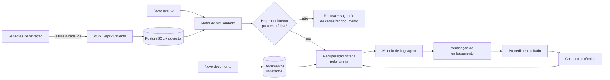
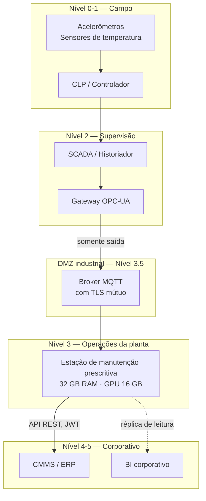

# Arquitetura da Solução e Implantação Industrial

Manutenção Prescritiva com IA — Processo Seletivo 02198/2026, FIESC / SENAI SC.

Este documento atende aos dois primeiros itens do §3 do enunciado: **arquitetura da
solução** e **definição de arquitetura técnica para implantação em ambiente
industrial**.

Todo número citado foi medido na implementação, não estimado. Onde há projeção,
está marcado como tal e a conta aparece.

---

## 1. O que o sistema faz

Uma máquina rotativa é monitorada por sensores de vibração. A cada leitura nova, o
sistema precisa responder três perguntas:

1. **Isso já aconteceu antes?** — busca no histórico as leituras de comportamento
   semelhante.
2. **O que era?** — deduz a falha pela condição anotada nas leituras semelhantes.
3. **O que eu faço?** — consulta o procedimento técnico daquela falha e monta o
   passo a passo, citando a página.

E uma quarta pergunta, que é o que separa esta solução de um chatbot: **quando é
que ele não deve responder?**

> O sistema deve se deter unicamente a problemas que possuem documentos, caso
> contrário deve reportar que ainda não existe o problema identificado e sugerir
> ao usuário para registrar um novo documento para o defeito.
>
> — §3 do enunciado

Essa frase governa o desenho inteiro. Ela não é um requisito de interface: é uma
regra de negócio que precisa ser **estrutural**, não uma instrução no prompt.

---

## 2. Restrições que governam o desenho

| Restrição | Origem | Consequência arquitetural |
| --- | --- | --- |
| Python | §5 | Backend, ETL, ML e RAG em Python |
| Inferência em estação com 32 GB RAM e GPU de 16 GB | §5 | Modelo de linguagem quantizado, embeddings em ONNX na CPU, banco vetorial embutido no PostgreSQL |
| Só responder o que está documentado | §3 | Gate determinístico **antes** da chamada ao modelo |
| Sem classificação prévia de falhas | §1 | Busca por similaridade, não classificador supervisionado |
| Dados chegam continuamente ao banco corporativo | §2 | Endpoint de ingestão, não só de consulta |

A restrição de hardware é a mais estruturante. Ela elimina a arquitetura padrão de
2026 — chamar uma API de LLM na nuvem — e força o desenho a caber em uma máquina
que fica no chão de fábrica.

---

## 3. Arquitetura da solução

### 3.1 Fluxo



O ponto que merece atenção: **o gate fica entre a similaridade e o modelo**. Se
não há documento, o modelo não é chamado. Não existe caminho no código que pule
essa verificação — ela está no `services/pipeline.py`, que é o único lugar onde a
sequência está escrita.

### 3.2 Correspondência com a Figura 01 do enunciado

| Elemento do diagrama | Implementação |
| --- | --- |
| Entrada / Novo evento json | `POST /api/v1/events` — aceita o payload do §2 literalmente |
| database | PostgreSQL 17 + pgvector |
| Documentos orientativos | 6 PDFs, 124 trechos indexados |
| Novos Documentos orientativos | `POST /api/v1/upload_doc` |
| Tipo de defeito | `diagnostico.familia` |
| Quantidade de ocorrências | `evidencia.eventos_da_familia` |
| Frequência de ocorrências | `evidencia.frequencia_por_dia` |
| Instruções de solução | `prescricao` — passos com citação por item |
| Chat ↔ Actor | `POST /api/internal/chat` |

Além das caixas, os itens citados no §1: distribuição ao longo do tempo
(`evidencia.linha_do_tempo`) e contexto operacional
(`evidencia.contexto_operacional`).

### 3.3 Camadas do backend

```
controllers/    rotas HTTP: autenticação, validação, tradução
services/       regra de negócio: similaridade, gate, RAG, prescrição
repositories/   acesso a dados — todas as consultas
models/         entidades e schema
core/           domínio puro: taxonomia e features, sem I/O
integrations/   fronteiras externas: LLM, embeddings, OCR
```

Regra que mantém a separação honesta: **um controller nunca monta consulta SQL, e
um repositório nunca chama LLM.**

### 3.4 As quatro camadas contra alucinação

| Camada | Mecanismo | O que impede |
| --- | --- | --- |
| 1 | Gate de cobertura, antes do modelo | Responder sobre falha sem documentação |
| 2 | Filtro rígido por família na recuperação | Citar o procedimento errado |
| 3 | Descarte de citação inventada no parse | Alucinação de fonte |
| 4 | Verificação de embasamento pós-geração | Passo sem origem no texto recuperado |

A camada 2 foi medida: sete consultas-sonda, uma por assunto. **4/7 de acerto sem
o filtro, 7/7 com ele.** Sem filtro, "ruído de impacto nas esferas do rolamento"
recupera o manual de correias — resposta fluente, citada e errada.

---

## 4. Arquitetura técnica de implantação industrial

### 4.1 Segmentação de rede

Uma planta não é um datacenter. A rede de automação (OT) é isolada da rede
corporativa (TI), e essa separação existe por segurança física: um comprometimento
na TI não pode alcançar o CLP que comanda o motor.

O modelo de referência é a hierarquia ISA-95 / Purdue:



Duas regras que a topologia impõe:

- **O fluxo de dados do processo é unidirecional**, do campo para cima. A estação
  de manutenção **lê** do broker; nunca escreve no CLP. O sistema recomenda, o
  técnico executa. Isso não é limitação técnica: é decisão de segurança
  funcional — nenhuma recomendação gerada por modelo de linguagem deve poder
  atuar sozinha sobre equipamento rotativo.
- **A estação não tem rota para a internet.** É o que torna o modelo local
  obrigatório, não apenas preferível. A restrição do §5 e a segmentação de rede
  apontam para a mesma decisão.

### 4.2 Topologia física

| Componente | Onde roda | Justificativa |
| --- | --- | --- |
| Coletor / gateway | Painel elétrico, próximo à máquina | Latência e resiliência a queda de rede |
| Broker MQTT | DMZ industrial | Ponto único de travessia entre OT e TI, auditável |
| Estação prescritiva | Sala técnica, nível 3 | Onde estão os 32 GB e a GPU de 16 GB |
| CMMS | Corporativo | Integração pela superfície externa da API |

A estação prescritiva concentra tudo: banco, API, modelo, embeddings e interface.
São quatro containers, definidos em dois `docker-compose.yml` independentes
(backend e frontend), unidos por uma rede externa.

Separar os compose não é organização cosmética: em planta, publicar uma correção
na interface não pode obrigar a derrubar o banco.

### 4.3 Aquisição e ingestão

O enunciado (§2) diz que os dados já chegam ao banco corporativo. A arquitetura
prevê os dois caminhos:

**Caminho A — o que está implementado.** O coletor faz `POST /api/v1/events` com o
JSON do §2. Aceita lote de até 1000 leituras, faz upsert por `id` — reenvio por
falha de rede não duplica.

**Caminho B — recomendado para a planta.** O gateway publica em um tópico MQTT
(`planta/linha1/maq01/vibracao`); um consumidor na estação lê e chama o mesmo
serviço de ingestão. Vantagem: o broker absorve indisponibilidade da estação. Se
ela cair para manutenção, as leituras ficam retidas e são drenadas na volta.

O caminho B não foi implementado — o contrato HTTP já existe e o consumidor MQTT
é um adaptador de poucas linhas sobre `services/ingestion.py`. Está registrado
como fora de escopo, não como esquecimento.

### 4.4 Dimensionamento

Medições sobre a base atual (166.796 leituras, 30 dias):

| Métrica | Valor medido |
| --- | ---: |
| Intervalo entre leituras | 2,0 s (p25 a p95) |
| Tamanho por leitura no disco | 695 bytes |
| Tabela `sensor_events` | 111 MB |
| Índice HNSW | 52 MB |
| Banco inteiro | 119 MB |

**Projeção de crescimento**, com amostragem contínua a 2 s:

```
43.200 leituras/dia/máquina  ×  695 B  =  30 MB/dia/máquina
                                          11 GB/ano/máquina
10 máquinas monitoradas               =  110 GB/ano
```

Um SSD de 2 TB acomoda mais de 15 anos de 10 máquinas. Armazenamento não é o
gargalo — mas convém definir política de retenção: leituras de estado normal com
mais de 2 anos podem ser agregadas por hora sem perda para o caso de uso.

**O índice vetorial cresce muito mais devagar que a base**, e isso é
arquitetural. O índice HNSW é parcial:

```sql
WHERE split <> 'holdout' AND fault_family IS NOT NULL
```

Só entram leituras **com condição anotada**. Uma leitura sem anotação é gravada e
fica disponível para consulta, mas não indexada — ela não teria como votar numa
busca por similaridade, já que a votação é pela condição anotada dos vizinhos.

Em operação, o operador anota o que é excepcional, não os 43.200 registros
diários de rotina. O índice acompanha a taxa de **anotação**, não a de
**amostragem**. Medido: 52 MB para 157.735 vetores anotados, ou **346 bytes por
vetor**. Uma planta que anote 200 eventos por dia acrescenta 24 MB por ano ao
índice — dez anos de operação cabem em 240 MB, integralmente em memória.

### 4.5 Orçamento da GPU de 16 GB

| Componente | VRAM | Observação |
| --- | ---: | --- |
| Modelo de linguagem 8B, quantização Q5_K_M | ~5,7 GB | Llama 3.1 8B ou equivalente |
| Cache de contexto (8k tokens, GQA) | ~1,5 GB | Suficiente para 6 trechos de manual |
| Reserva do driver e fragmentação | ~1,0 GB | |
| **Total** | **~8,2 GB** | Folga de 48% |

Cabe também um modelo de 14B em Q4_K_M (~9 GB + 1,5 GB de contexto ≈ 10,5 GB),
com folga de 34%. A escolha entre 8B e 14B é de qualidade contra latência, não de
capacidade — as duas cabem.

**O que fica fora da GPU, deliberadamente:**

| Componente | Onde | Consumo |
| --- | --- | ---: |
| Embeddings (`paraphrase-multilingual-MiniLM`) | CPU, ONNX Runtime | ~120 MB RAM |
| OCR (`rapidocr-onnxruntime`) | CPU, ONNX Runtime | ~50 MB RAM, só na indexação |
| Busca vetorial (HNSW) | CPU, dentro do PostgreSQL | 52 MB |

Manter embeddings e OCR na CPU libera a GPU inteira para o modelo de linguagem. É
possível porque ambos são modelos pequenos em ONNX: a indexação completa dos seis
documentos roda em menos de dois minutos sem GPU.

**Orçamento dos 32 GB de RAM:**

| Componente | RAM |
| --- | ---: |
| PostgreSQL (`shared_buffers` 8 GB + work_mem) | ~10 GB |
| Cache de páginas do sistema operacional | ~12 GB |
| API, embeddings e OCR | ~3 GB |
| Sistema operacional e margem | ~7 GB |

### 4.6 Latência esperada

Medições na implementação atual (modelo por API; o local é projeção):

| Etapa | Medido | Projeção com modelo local |
| --- | ---: | ---: |
| Ingestão de leitura | < 20 ms | igual |
| Diagnóstico por similaridade | **78 ms** | igual |
| Recuperação nos documentos | ~1,3 s | ~300 ms com modelo pré-carregado |
| Geração do procedimento | 38 s (DeepSeek v4) | ~20 s (8B a 40 tok/s) |
| Resposta no chat | 6–8 s | ~5 s |

O diagnóstico responder em 78 ms é o que permite separar as duas etapas na
interface: identificar a falha é instantâneo, redigir o procedimento não é. Juntar
as duas obrigaria o operador a esperar 40 s só para saber qual é a falha.

Para o caso de uso, 20 s para um procedimento completo é aceitável: o técnico
está caminhando até a máquina.

### 4.7 Segurança

**Duas superfícies de API, dois mecanismos**, porque os riscos são diferentes:

| Superfície | Mecanismo | Consumidor |
| --- | --- | --- |
| `/api/v1/*` | JWT `Bearer` com escopos | CMMS, supervisório, coletor |
| `/api/internal/*` | Chave estática `X-Internal-Key` | Frontend, via proxy |

Os escopos são `predict`, `upload` e `ingest`, e um cliente pode pedir menos do
que tem direito. Isso importa: **`upload_doc` escreve na base que orienta
intervenção física em equipamento.** Quem consegue injetar documento consegue
influenciar o que o sistema recomenda ao técnico. Um coletor de dados que só envia
leitura não precisa desse poder.

A chave interna vive no proxy do container do frontend e é injetada no cabeçalho
ali — nunca chega ao navegador. Qualquer segredo no bundle é público.

Outras decisões:

- Comparação de credenciais em tempo constante (`hmac.compare_digest`).
- Mensagem de erro idêntica para identificador errado e segredo errado —
  diferenciar entregaria ao atacante a informação de que aquele cliente existe.
- A API **não sobe** sem segredo configurado. Uma API industrial no ar sem
  autenticação é pior que uma API fora do ar: o problema só aparece depois.
- Tipo de arquivo no upload conferido pela assinatura (`%PDF-`), não pela extensão
  nem pelo content-type — os dois vêm do cliente e podem mentir.

### 4.8 Disponibilidade e degradação

O sistema é **auxiliar**: a planta opera sem ele. Isso permite um desenho de
degradação em camadas em vez de alta disponibilidade cara.

| Falha | Efeito | Comportamento |
| --- | --- | --- |
| Modelo de linguagem indisponível | Sem procedimento gerado | Diagnóstico, evidência estatística e eventos similares continuam; a resposta diz o que houve |
| Documento não indexado | Sem recomendação para aquela falha | Recusa explícita com sugestão de cadastrar |
| Banco fora | Sistema indisponível | `/api/health` reporta falha; a interface mostra estado degradado, não tela quebrada |
| Estação fora | Sem análise | Com o broker MQTT (caminho B), as leituras ficam retidas e são drenadas na volta |

`/api/health` verifica de verdade cada componente — banco, volume de leituras,
documentos indexados, scaler e credencial do modelo. Um health que sempre responde
`ok` não serve para monitoramento; cria a ilusão de que algo está sendo observado.

**Backup:** dump diário do PostgreSQL. Os artefatos derivados (scaler, cache de
OCR, índice) são reconstruíveis por comando, então o que precisa de backup é a
tabela de leituras e os PDFs originais.

### 4.9 Observabilidade

- Log estruturado por requisição, com identificador que volta no cabeçalho
  `X-Request-ID`. Quando alguém reporta "a análise deu errado às 14h32", o
  identificador liga a queixa à linha exata do log.
- Toda resposta de análise traz o tempo de cada etapa: similaridade, cobertura,
  recuperação, geração e verificação.
- Consumo do modelo registrado por chamada: modelo, tokens de entrada, saída e
  **tokens de raciocínio** — este último revelou um problema real, descrito na
  seção 6.

### 4.10 Ciclo de vida

Quatro artefatos com ritmos diferentes:

| Artefato | Quando muda | Comando |
| --- | --- | --- |
| Leituras | Continuamente | `POST /api/v1/events` |
| Documentos | Quando a engenharia publica procedimento | `POST /api/v1/upload_doc` |
| Scaler de features | Só se a distribuição mudar muito | `manage.py ingest` |
| Índice vetorial | Ao trocar o modelo de embeddings | `manage.py ingest-docs --force` |

O metadado do índice grava o modelo e a dimensão usados. Trocar o modelo sem
reindexar corromperia o índice em silêncio — vetores antigos e novos viveriam no
mesmo espaço sem serem comparáveis. Com o metadado, a divergência é detectada e
bloqueada com erro claro.

**Recalibração do limiar de confiança.** O limiar que decide entre responder e se
abster (`SIMILARITY_CONFIDENCE_MIN`) é uma escolha explícita, com efeito medido:

| Limiar | Cobertura | Precisão |
| ---: | ---: | ---: |
| 0,50 | 74% | 47% |
| 0,60 | 59% | 53% |
| **0,70** | **47%** | **59%** |
| 0,90 | 25% | 70% |

Em planta esse número deveria ser revisto trimestralmente contra as ordens de
serviço fechadas — é o único jeito de saber se o sistema está acertando de
verdade, e não apenas concordando com o histórico.

---

## 5. Implantação em fases

| Fase | Escopo | Critério de saída |
| --- | --- | --- |
| **1 — Sombra** | Sistema recebe leituras e registra diagnóstico, sem mostrar a ninguém | Acurácia medida contra as ordens de serviço reais por 30 dias |
| **2 — Consulta** | Técnicos consultam sob demanda; recomendação não entra em ordem de serviço | Uso espontâneo e retorno qualitativo da equipe |
| **3 — Integrado** | Recomendação anexada à ordem de serviço no CMMS | Redução mensurável no tempo de diagnóstico |
| **4 — Expansão** | Demais máquinas da linha | Reuso do pipeline sem código específico por máquina |

A fase 1 existe porque o resultado medido no conjunto de teste (seção 6) não
autoriza pular direto para uso operacional. Colocar em sombra custa pouco e
produz o dado que falta.

---

## 6. Resultados medidos e o que eles significam

Reportados como medidos. O relatório completo e reproduzível está em
`backend/docs/analise/`.

**Acurácia do diagnóstico no conjunto de teste: 40,2%** sobre 3.000 leituras.

Três investigações explicam o número:

**A família `falta_fase` não tem histórico.** 800 leituras no conjunto de teste,
zero no de treino. Nenhuma busca por similaridade poderia acertá-la — o correto é
recusar, não adivinhar.

**O teto é dos dados, não do método.** Um classificador supervisionado
(HistGradientBoosting) nas mesmas features atinge 39,8% no teste contra 78,8% no
próprio treino. KNN e classificador chegam ao mesmo lugar: existe deslocamento de
distribuição entre o histórico e as sessões de coleta mais recentes.

**Distância é um péssimo sinal de confiança** — e essa foi a descoberta que mudou
o desenho. O plano original usaria distância ao vizinho mais próximo como detector
de anomalia. A medição mostrou o oposto:

| Portão | Cobertura | Precisão |
| --- | ---: | ---: |
| sem portão | 100% | 40,2% |
| distância ≤ 0,5 | 13% | **18,4%** |
| concordância ≥ 0,70 | 47% | 59,2% |
| concordância ≥ 0,95 | 19% | **73,4%** |

Quanto mais próximo o vizinho, pior a precisão: os mais próximos caem no cluster
dominante de `rolamento`, 36% do histórico. Seguir o plano original teria
produzido alta confiança exatamente nos casos mais enviesados.

**Consequência arquitetural:** prescrever intervenção física com 40% de acerto é
pior que admitir desconhecimento. A abstenção não é uma falha do sistema — é o
comportamento correto, e por isso ela tem tratamento visual próprio na interface,
distinto do estado de erro.

Um problema de operação encontrado na implementação e que vale para a implantação:
o modelo de linguagem escolhido é de raciocínio, e consumia todo o orçamento de
tokens "pensando" antes de escrever, devolvendo resposta vazia sem explicação. Ao
dimensionar o modelo local, o orçamento de saída precisa contar os tokens de
raciocínio, não só o tamanho da resposta desejada.

---

## 7. Alternativas consideradas e descartadas

| Alternativa | Por que não |
| --- | --- |
| Banco vetorial dedicado (Qdrant, Milvus) | 167 mil vetores de 16 dimensões e algumas centenas de trechos não justificam um segundo serviço. Com pgvector, dá para cruzar vizinhança de sensor e metadado de falha em uma consulta SQL |
| Classificador supervisionado de falhas | O §1 pede explicitamente que a solução não dependa de classificação prévia. E um classificador não responderia "quantos eventos parecidos já ocorreram" |
| Modelo de linguagem na nuvem | A restrição do §5 e a segmentação de rede apontam para o mesmo lugar. A camada `integrations/llm.py` isola o provider — trocar para um servidor local compatível com OpenAI é mudança de `.env` |
| Embeddings por API | Custo por consulta e dependência de rede em ambiente que não tem rota para a internet |
| Tesseract para OCR | Exigiria binário no sistema. `rapidocr-onnxruntime` instala por pip e roda na CPU |
| Alpine nas imagens | numpy, scikit-learn e onnxruntime publicam rodas para glibc; no musl o pip compilaria do fonte |
| Fila (Celery, RQ) para indexar documento | Os documentos têm ~10 páginas e indexam em segundos. A fila viria com infraestrutura sem ganho perceptível |
| Verificação de embasamento por LLM | Custo, latência, e o problema de que o juiz alucina igual. A verificação léxica é conservadora e determinística |

---

## 8. Riscos conhecidos

| Risco | Impacto | Mitigação |
| --- | --- | --- |
| Deslocamento de distribuição entre sessões de coleta | Acurácia cai em dados novos | Fase de sombra; recalibração trimestral do limiar contra ordens de serviço |
| Três famílias sem procedimento cadastrado | 29.596 leituras de falha sem recomendação possível — 19,6% do total classificado como problema | Fluxo de cadastro implementado; a lacuna aparece no painel como ação pendente |
| OCR perde diacríticos | Texto do Doc1 não é fiel ao original | Documentos vindos de OCR ficam sinalizados; toda prescrição baseada neles traz aviso |
| Operador anota pouco | Índice cresce devagar demais | Métrica de taxa de anotação no painel; o sistema melhora com o uso |
| Verificação de embasamento é léxica | Prova origem, não correção técnica | Declarado como limitação; combinada com as outras três camadas |
| Modelo local mais fraco que o de API | Prescrição menos fluente | Mitigado pelas restrições estruturais: o modelo só redige, não escolhe fonte nem decide se pode responder |

---

## 9. Resumo das decisões

1. **Um banco só** (PostgreSQL + pgvector) para vetor de sensor e embedding de documento.
2. **Busca por similaridade**, não classificador — como o enunciado pede.
3. **Índice HNSW parcial**, excluindo o conjunto de teste e as leituras sem rótulo.
4. **Gate determinístico antes do modelo**: sem documento, o modelo não é chamado.
5. **Filtro rígido por família** na recuperação — vale 3 sondas em 7.
6. **Embeddings e OCR na CPU**, em ONNX, liberando a GPU para o modelo.
7. **Duas superfícies de API** com autenticações e escopos diferentes.
8. **Compose separado por aplicação**, ciclos de vida independentes.
9. **Abstenção como comportamento correto**, não como falha.
